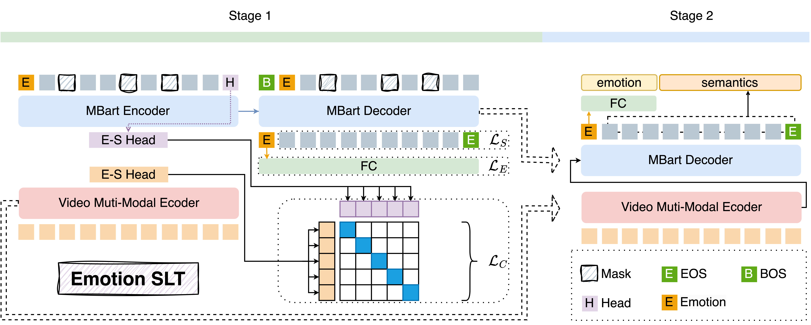

# Sign Language Translation

## 框架图



## 附加

```bash
# 解决 huggince face 无法下载模型
# 目录：/root/miniconda3/lib/python3.8/site-packages/huggingface_hub/constants.py 
# 将 ENDPOINT = os.getenv("HF_ENDPOINT") or ("https://hub-ci.huggingface.co" if _staging_mode else "https://huggingface.co") 类似的修改成
ENDPOINT = " https://hf-mirror.com"

# 命令行删除 git 所有进程：
ps aux | grep git | awk '{print $2}' | xargs kill -9
```

## 待更新
